In this script we will provide some intuition for harmonic regression, and walk through how to reconstruct temporally dynamic coefficients when fitting step selection (or other) models with harmonic terms. We will use the example of a model fitted with two pairs of harmonics. We will then use the coefficients to reconstruct the selection surfaces from models fitted with linear and quadratic terms that were interacted with the harmonics.


Load packages


::: {.cell}

```{.r .cell-code  code-summary="Loading packages"}
options(scipen=999)

library(tidyverse)
packages <- c("lubridate", "tictoc", "TwoStepCLogit", "beepr", "scales")
walk(packages, require, character.only = T)
```
:::


Harmonics are sine and cosine functions are periodic functions that repeat once per cycle, $T$. When combined, they can be used to model complex periodic patterns, and with many harmonics can create very flexible functions.

Harmonics can be considered similarly to splines or basis functions in that they are additive - if we add them all together we get a single, flexible function.

Let's say we have a single pair of harmonics, $s_1 = \sin(2\pi t / T)$, and $c_1 = \cos(2\pi t / T)$, where $t \in T$. For a yearly cycle for instance, $t$ would be indexed as the day of the year, and $T = 365$, although $t$ does not need to be integer-valued, and can be arbitrarily fine. In the case of the model we are fitting here, $t$ is the hour of the day, for $T$ is the number of hours in a day, 24.


::: {.cell}

```{.r .cell-code}
# create a sequence of hours
t <- seq(0,23,0.1)
T <- 24

# create the harmonic terms
sin1 <- sin(2 * pi * t / T)
cos1 <- cos(2 * pi * t / T)

# plot the harmonic terms
plot(t, sin1, type = "l", col = "red", 
     xlab = "Hour of the day", ylab = "Value", 
     main = "Harmonic terms", ylim = c(-2.5,2.5))
lines(t, cos1, col = "blue")
lines(t, rep(0,length(t)), lty = "dashed")
```

::: {.cell-output-display}
{width=2100}
:::
:::


Now what we can do is add them together to create a single function. 


::: {.cell}

```{.r .cell-code}
# create a single function
f_harmonic <- sin1 + cos1

# plot the function
plot(t, f_harmonic, type = "l", col = "black", 
     xlab = "Hour of the day", ylab = "Value", 
     main = "Harmonic function", 
     ylim = c(-2.5,2.5))
lines(t, rep(0,length(t)), lty = "dashed")
```

::: {.cell-output-display}
{width=2100}
:::
:::


It looks similar, although now the amplitude is greater (up to about 1.4 now), and that the peak has shifted to be an average of the sine and cosine functions (peak is now at 3 ( = 0 + 6 / 2). We can shift the location of the peak by giving one of the terms more influence.


::: {.cell}

```{.r .cell-code}
# create a single function
f_harmonic <- 2*sin1 + cos1

# plot the function
plot(t, f_harmonic, type = "l", col = "black", 
     xlab = "Hour of the day", ylab = "Value", 
     main = "Harmonic function", ylim = c(-2.5,2.5))
lines(t, rep(0,length(t)), lty = "dashed")
```

::: {.cell-output-display}
{width=2100}
:::
:::


If we give more weight to the sine function, the peak will shift to the right, which is closer to the peak of the sine function, and vice versa. We can see it has also changed the amplitude, which now peaks above y = 2.

We can also add a constant term, which will just shift the entire function up or down.


::: {.cell}

```{.r .cell-code}
# create a single function
f_harmonic <- 1 + 2*sin1 + cos1

# plot the function
plot(t, f_harmonic, type = "l", col = "black", 
     xlab = "Hour of the day", ylab = "Value", 
     main = "Harmonic function", ylim = c(-2.5,2.5))
lines(t, rep(0,length(t)), lty = "dashed")
```

::: {.cell-output-display}
{width=2100}
:::
:::


We can see that adding a constant, and by weighting the sin and cosine terms we can start to create a flexible function. If we only use 1 pair of harmonics we can only have one period, but if we use more pairs we can have more periods, and therefore more flexibility. Let's add some more pairs of harmonics.


::: {.cell}

```{.r .cell-code}
# create two more harmonic terms
sin2 <- sin(4 * pi * t / T)
cos2 <- cos(4 * pi * t / T)

# plot the harmonic terms
plot(t, sin2, type = "l", col = "red", 
     xlab = "Hour of the day", ylab = "Value", 
     main = "Harmonic terms", ylim = c(-2.5,2.5))
lines(t, cos2, col = "blue")
lines(t, rep(0,length(t)), lty = "dashed")
```

::: {.cell-output-display}
{width=2100}
:::
:::


Again we can add these together, and weight to shift the peak and change the amplitude.


::: {.cell}

```{.r .cell-code}
# create a single function
f_harmonic <- 0.5*sin2 + 1.5*cos2

# plot the function
plot(t, f_harmonic, type = "l", col = "black", 
     xlab = "Hour of the day", ylab = "Value", 
     main = "Harmonic function", ylim = c(-2.5,2.5))
lines(t, rep(0,length(t)), lty = "dashed")
```

::: {.cell-output-display}
{width=2100}
:::
:::


Now we can start to add all of our components together to create flexible functions (and there is really no limit to this - infinitely flexible functions can be created with infinitely many harmonic terms, which is called a Fourier series - for some very cool intuition about Fourier series check out: https://www.youtube.com/watch?v=r6sGWTCMz2k).


::: {.cell}

```{.r .cell-code}
# create a single function
f_harmonic <- 1 + 0.5*sin1 + 2*cos1 + 0.75*sin2 + 1.25*cos2

# plot the function
plot(t, f_harmonic, type = "l", col = "black", 
     xlab = "Hour of the day", ylab = "Value", 
     main = "Harmonic function")
lines(t, rep(0,length(t)), lty = "dashed")
```

::: {.cell-output-display}
{width=2100}
:::
:::


If you play around with the weights you can estimate some really funky functions, and the function will just get more flexible the more harmonic terms that you add.


::: {.cell}

```{.r .cell-code}
# create more harmonic terms...
sin3 <- sin(6 * pi * t / T)
cos3 <- cos(6 * pi * t / T)
sin4 <- sin(8 * pi * t / T)
cos4 <- cos(8 * pi * t / T)

# create a single function
f_harmonic <- 0.5 + 0.5*sin1 + 1.5*cos1 + 2*sin2 + 1.25*cos2 + 0.25*sin3 + 0.5*cos3 + 0.1*sin4 + 2*cos4

# plot the function
plot(t, f_harmonic, type = "l", col = "black", 
     xlab = "Hour of the day", ylab = "Value", 
     main = "Harmonic function")
lines(t, rep(0,length(t)), lty = "dashed")
```

::: {.cell-output-display}
{width=2100}
:::
:::


Hopefully now you have some intuition about what we are doing with the harmonic terms in our step selection function, in that we are estimating the weights of the sine and cosine functions, which are the coefficients from our fitted models. Pretty cool!

Let's have a look at some real data now, and fit a model with the harmonics.

# Buffalo example

Importing buffalo data for model fitting, and creating harmonic terms using the time at the *end* of the step.


::: {.cell}

```{.r .cell-code}
buffalo_data_all <- read_csv("data_for_scripts/buffalo_ssf_10rs_2024-09-04.csv")
```

::: {.cell-output .cell-output-stderr}

```
Rows: 1165406 Columns: 22
── Column specification ────────────────────────────────────────────────────────
Delimiter: ","
dbl  (18): id, burst_, x1_, x2_, y1_, y2_, sl_, ta_, dt_, hour_t2, step_id_,...
lgl   (1): case_
dttm  (3): t1_, t2_, t2_rounded

ℹ Use `spec()` to retrieve the full column specification for this data.
ℹ Specify the column types or set `show_col_types = FALSE` to quiet this message.
```


:::

```{.r .cell-code}
buffalo_data_all <- buffalo_data_all %>% 
  mutate(t1_ = lubridate::with_tz(buffalo_data_all$t1_, tzone = "Australia/Darwin"),
         t2_ = lubridate::with_tz(buffalo_data_all$t2_, tzone = "Australia/Darwin"))

buffalo_data_all <- buffalo_data_all %>%
  mutate(id_num = as.numeric(factor(id)),
         step_id = step_id_,
         x1 = x1_, x2 = x2_,
         y1 = y1_, y2 = y2_,
         t1 = t1_,
         t1_rounded = round_date(buffalo_data_all$t1_, "hour"),
         hour_t1 = hour(t1_rounded),
         t2 = t2_,
         t2_rounded = round_date(buffalo_data_all$t2_, "hour"),
         hour_t2 = hour(t2_rounded),
         hour = hour_t2,
         yday = yday(t1_),
         year = year(t1_),
         month = month(t1_),
         sl = sl_,
         log_sl = log(sl_),
         ta = ta_,
         cos_ta = cos(ta_),
         # scale canopy cover from 0 to 1
         canopy_01 = canopy_cover/100,
         # here we create the harmonic terms for the hour of the day
         # for seasonal effects, change hour to day of the year (which is t), 
         # and 24 to 365 (which is T)
         hour_s1 = sin(2*pi*hour/24),
         hour_s2 = sin(4*pi*hour/24),
         hour_s3 = sin(6*pi*hour/24),
         hour_c1 = cos(2*pi*hour/24),
         hour_c2 = cos(4*pi*hour/24),
         hour_c3 = cos(6*pi*hour/24))

# to just select a single year of data
buffalo_data_all <- buffalo_data_all %>% filter(t1 < "2019-07-25 09:32:42 ACST")
buffalo_ids <- unique(buffalo_data_all$id)
```
:::


## Fitting the model with two pairs of harmonics

### Creating a data matrix

First we create a data matrix to be provided to the model, and then we scale and centre the full data matrix, with respect to each of the columns. That means that all variables are scaled and centred *after* the data has been split into wet and dry season data, and also after creating the quadratic and harmonic terms (when using them).

This is where we interact the harmonic terms with our covariates. As we have already created the harmonic terms for the hour of the day (s1, c1, s2, etc), we just interact (multiply) these with each of the covariates, including the quadratic terms and movement parameters. As before, we create the data matrix with all quadratic and harmonic terms, and *then* scale the matrix by each column, and store the scaling and centering variables to reconstruct the natural scale coefficients (i.e. if we were to fit the model without centering and scaling).


::: {.cell}

```{.r .cell-code}
months_wet <- c(1:4, 11:12)
buffalo_ids <- unique(buffalo_data_all$id)

# buffalo_data <- buffalo_data_all %>% filter(month %in% months_wet) # wet season
buffalo_data <- buffalo_data_all %>% filter(!month %in% months_wet) # dry season

buffalo_data_matrix_unscaled <- buffalo_data %>% transmute(
  
  ndvi = ndvi_temporal,
  ndvi_s1 = ndvi_temporal * hour_s1,
  ndvi_s2 = ndvi_temporal * hour_s2,
  ndvi_c1 = ndvi_temporal * hour_c1,
  ndvi_c2 = ndvi_temporal * hour_c2,
  
  ndvi_sq = ndvi_temporal ^ 2,
  ndvi_sq_s1 = (ndvi_temporal ^ 2) * hour_s1,
  ndvi_sq_s2 = (ndvi_temporal ^ 2) * hour_s2,
  ndvi_sq_c1 = (ndvi_temporal ^ 2) * hour_c1,
  ndvi_sq_c2 = (ndvi_temporal ^ 2) * hour_c2,
  
  canopy = canopy_01,
  canopy_s1 = canopy_01 * hour_s1,
  canopy_s2 = canopy_01 * hour_s2,
  canopy_c1 = canopy_01 * hour_c1,
  canopy_c2 = canopy_01 * hour_c2,
  
  canopy_sq = canopy_01 ^ 2,
  canopy_sq_s1 = (canopy_01 ^ 2) * hour_s1,
  canopy_sq_s2 = (canopy_01 ^ 2) * hour_s2,
  canopy_sq_c1 = (canopy_01 ^ 2) * hour_c1,
  canopy_sq_c2 = (canopy_01 ^ 2) * hour_c2,
  
  slope = slope,
  slope_s1 = slope * hour_s1,
  slope_s2 = slope * hour_s2,
  slope_c1 = slope * hour_c1,
  slope_c2 = slope * hour_c2,
  
  herby = veg_herby,
  herby_s1 = veg_herby * hour_s1,
  herby_s2 = veg_herby * hour_s2,
  herby_c1 = veg_herby * hour_c1,
  herby_c2 = veg_herby * hour_c2,
  
  step_l = sl,
  step_l_s1 = sl * hour_s1,
  step_l_s2 = sl * hour_s2,
  step_l_c1 = sl * hour_c1,
  step_l_c2 = sl * hour_c2,

  log_step_l = log_sl,
  log_step_l_s1 = log_sl * hour_s1,
  log_step_l_s2 = log_sl * hour_s2,
  log_step_l_c1 = log_sl * hour_c1,
  log_step_l_c2 = log_sl * hour_c2,

  cos_turn_a = cos_ta,
  cos_turn_a_s1 = cos_ta * hour_s1,
  cos_turn_a_s2 = cos_ta * hour_s2,
  cos_turn_a_c1 = cos_ta * hour_c1,
  cos_turn_a_c2 = cos_ta * hour_c2)

buffalo_data_matrix_scaled <- scale(buffalo_data_matrix_unscaled)

# store the scaling and centering attribues to recover the natural scale coefficients
mean_vals <- attr(buffalo_data_matrix_scaled, "scaled:center")
sd_vals <- attr(buffalo_data_matrix_scaled, "scaled:scale")
scaling_attributes <- data.frame(variable = names(buffalo_data_matrix_unscaled), 
                                 mean = mean_vals, sd = sd_vals)

buffalo_data_scaled_2p <- data.frame(id = buffalo_data$id,  
                                     step_id = buffalo_data$step_id, 
                                     y = buffalo_data$y, 
                                     buffalo_data_matrix_scaled)
```
:::


### Formula with two pairs of harmonics

We add in all the terms in the model formula. We can see that we are adding all of these together, which allows us to add them together later to reconstruct the harmonic function.


::: {.cell}

```{.r .cell-code}
formula_twostep <- y ~ 
  
  ndvi +
  ndvi_s1 +
  ndvi_s2 +
  ndvi_c1 +
  ndvi_c2 +
  
  ndvi_sq +
  ndvi_sq_s1 +
  ndvi_sq_s2 +
  ndvi_sq_c1 +
  ndvi_sq_c2 +
  
  canopy +
  canopy_s1 +
  canopy_s2 +
  canopy_c1 +
  canopy_c2 +
  
  canopy_sq +
  canopy_sq_s1 +
  canopy_sq_s2 +
  canopy_sq_c1 +
  canopy_sq_c2 +
  
  slope +
  slope_s1 +
  slope_s2 +
  slope_c1 +
  slope_c2 +
  
  herby +
  herby_s1 +
  herby_s2 +
  herby_c1 +
  herby_c2 +
  
  step_l +
  step_l_s1 +
  step_l_s2 +
  step_l_c1 +
  step_l_c2 +
  
  log_step_l +
  log_step_l_s1 +
  log_step_l_s2 +
  log_step_l_c1 +
  log_step_l_c2 +

  cos_turn_a +
  cos_turn_a_s1 +
  cos_turn_a_s2 +
  cos_turn_a_c1 +
  cos_turn_a_c2 +
  
  strata(step_id) +
  cluster(id)
```
:::


## Fitting the model

As we have already fitted the model, we will load it here, but if the model_fit object file doesn't exist, it will run the model fitting code. Be careful here that if you change the model formula, you will need to delete or rename the model_fit file to re-run the model fitting code, otherwise it will just load the previous model.


::: {.cell}

```{.r .cell-code}
  tic()
  model_twostep_2p_harms <- Ts.estim(formula = formula_twostep,
           data = buffalo_data_scaled_2p,
           all.m.1 = TRUE,
           D = "UN(1)",
           itermax = 10000)
  toc()
```

::: {.cell-output .cell-output-stdout}

```
622.39 sec elapsed
```


:::
:::


## Check the model output

It will output a massive covariance matrix, which can be ignored for our purposes at the moment. We are interested in the coefficients, which are stored in the `beta` attribute of the model object.


::: {.cell}

```{.r .cell-code}
model_twostep_2p_harms$beta
```

::: {.cell-output .cell-output-stdout}

```
         ndvi       ndvi_s1       ndvi_s2       ndvi_c1       ndvi_c2 
  1.161893282   0.714922760   0.113055141  -0.967183016   1.204151199 
      ndvi_sq    ndvi_sq_s1    ndvi_sq_s2    ndvi_sq_c1    ndvi_sq_c2 
 -1.327782963  -0.428323139  -0.058775862   0.140541269  -0.438886908 
       canopy     canopy_s1     canopy_s2     canopy_c1     canopy_c2 
  0.243181981   0.169425294  -0.212793698   0.012453094   0.268704849 
    canopy_sq  canopy_sq_s1  canopy_sq_s2  canopy_sq_c1  canopy_sq_c2 
 -0.330862304  -0.083271931   0.125532678  -0.204852262  -0.169402632 
        slope      slope_s1      slope_s2      slope_c1      slope_c2 
 -0.182169983  -0.018788407  -0.073605924  -0.073079922  -0.057404958 
        herby      herby_s1      herby_s2      herby_c1      herby_c2 
 -0.002559875  -0.017446527   0.002161114   0.131812567  -0.035708056 
       step_l     step_l_s1     step_l_s2     step_l_c1     step_l_c2 
 -0.491817044  -0.123380017  -0.568516944  -0.161718824  -0.272122631 
   log_step_l log_step_l_s1 log_step_l_s2 log_step_l_c1 log_step_l_c2 
  0.249093381  -0.121921392  -0.143440949  -0.238005079   0.024836776 
   cos_turn_a cos_turn_a_s1 cos_turn_a_s2 cos_turn_a_c1 cos_turn_a_c2 
 -0.005131786  -0.042839003  -0.183409526  -0.059710062  -0.026697570 
```


:::
:::


Create a dataframe of the coefficients with the scaling attributes, and return the coefficients to their natural scale by dividing by the scaling factor (standard deviation).

As we can see, we have a coefficient for each covariate by itself, and then one for each of the harmonics. These are the 'weights' that we played around with above, and we reconstruct them in exactly the same way. We also have the coefficients for the quadratic terms and the interactions with the harmonics, which I have denoted as `ndvi_sq` for instance. We will come back to these when we look at the selection surfaces.


::: {.cell}

```{.r .cell-code}
# creating data frame of model coefficients
coefs_clr <- data.frame(coefs = names(model_twostep_2p_harms$beta), 
                        value = model_twostep_2p_harms$beta)

coefs_clr$scale_sd <- scaling_attributes$sd
coefs_clr <- coefs_clr %>% mutate(value_nat = value / scale_sd)
head(coefs_clr, 10)
```

::: {.cell-output-display}
`````{=html}
<div data-pagedtable="false">
  <script data-pagedtable-source type="application/json">
{"columns":[{"label":[""],"name":["_rn_"],"type":[""],"align":["left"]},{"label":["coefs"],"name":[1],"type":["chr"],"align":["left"]},{"label":["value"],"name":[2],"type":["dbl"],"align":["right"]},{"label":["scale_sd"],"name":[3],"type":["dbl"],"align":["right"]},{"label":["value_nat"],"name":[4],"type":["dbl"],"align":["right"]}],"data":[{"1":"ndvi","2":"1.16189328","3":"0.1433974","4":"8.1026108","_rn_":"ndvi"},{"1":"ndvi_s1","2":"0.71492276","3":"0.2379242","4":"3.0048344","_rn_":"ndvi_s1"},{"1":"ndvi_s2","2":"0.11305514","3":"0.2377890","4":"0.4754431","_rn_":"ndvi_s2"},{"1":"ndvi_c1","2":"-0.96718302","3":"0.2427744","4":"-3.9838750","_rn_":"ndvi_c1"},{"1":"ndvi_c2","2":"1.20415120","3":"0.2429118","4":"4.9571546","_rn_":"ndvi_c2"},{"1":"ndvi_sq","2":"-1.32778296","3":"0.1024719","4":"-12.9575318","_rn_":"ndvi_sq"},{"1":"ndvi_sq_s1","2":"-0.42832314","3":"0.1072086","4":"-3.9952306","_rn_":"ndvi_sq_s1"},{"1":"ndvi_sq_s2","2":"-0.05877586","3":"0.1081772","4":"-0.5433295","_rn_":"ndvi_sq_s2"},{"1":"ndvi_sq_c1","2":"0.14054127","3":"0.1109482","4":"1.2667283","_rn_":"ndvi_sq_c1"},{"1":"ndvi_sq_c2","2":"-0.43888691","3":"0.1101888","4":"-3.9830461","_rn_":"ndvi_sq_c2"}],"options":{"columns":{"min":{},"max":[10]},"rows":{"min":[10],"max":[10]},"pages":{}}}
  </script>
</div>
`````
:::
:::


Let's have a look at herbaceous vegetation as it didn't have a quadratic term.

Firstly, as above, we need a sequence of values that covers a full period (or the period that we want to construct the function over, which can be more or less than 1 period). The sequence can be arbitrarily finely spaced. The smaller the increment the smoother the function will be for plotting. When simulating data from the temporally dynamic coefficients, however, one would use the increment that relates to the data collection and model fitting (i.e. one hour in this case).

Here we'll use a finer resolution than above for smoother plotting


::: {.cell}

```{.r .cell-code}
hour_seq <- seq(0,23.9,0.1)
```
:::


Now we can reconstruct the harmonic function using the formula that we put into our model by interacting the harmonic terms with each of the covariates, for a single covariate, let's say herbaceous vegetation, this would be written down as:

$$
f = \beta_{herby} + 
\beta_{herby\_s1} \sin\left(\frac{2\pi t}{24}\right) +
\beta_{herby\_c1} \cos\left(\frac{2\pi t}{24}\right) +
\beta_{herby\_s2} \sin\left(\frac{4\pi t}{24}\right) +
\beta_{herby\_c2} \cos\left(\frac{4\pi t}{24}\right)
$$

We can precompute the harmonic terms to make it a bit neater (as we did for the design matrix before fitting our model)


::: {.cell}

```{.r .cell-code}
t <- hour_seq
T <- 24

sin1 <- sin(2 * pi * t / T)
cos1 <- cos(2 * pi * t / T)
sin2 <- sin(4 * pi * t / T)
cos2 <- cos(4 * pi * t / T)
```
:::


Now we just pull out the relevant coefficients (which are scalars (single numbers), like the weights we used above), multiply them by the harmonic terms (which are vectors representing the function through time), and add them together.


::: {.cell}

```{.r .cell-code}
herby_harmonic_function <- coefs_clr$value[which(coefs_clr$coefs == "herby")] +
  coefs_clr$value[which(coefs_clr$coefs == "herby_s1")] * sin1 +
  coefs_clr$value[which(coefs_clr$coefs == "herby_c1")] * cos1 +
  coefs_clr$value[which(coefs_clr$coefs == "herby_s2")] * sin2 +
  coefs_clr$value[which(coefs_clr$coefs == "herby_c2")] * cos2

# plot the function
plot(t, herby_harmonic_function, type = "l", col = "black", 
     xlab = "Hour of the day", ylab = "Coefficient value (scaled)", 
     main = "Herbaceous vegetation")
lines(t, rep(0,length(t)), lty = "dashed")
```

::: {.cell-output-display}
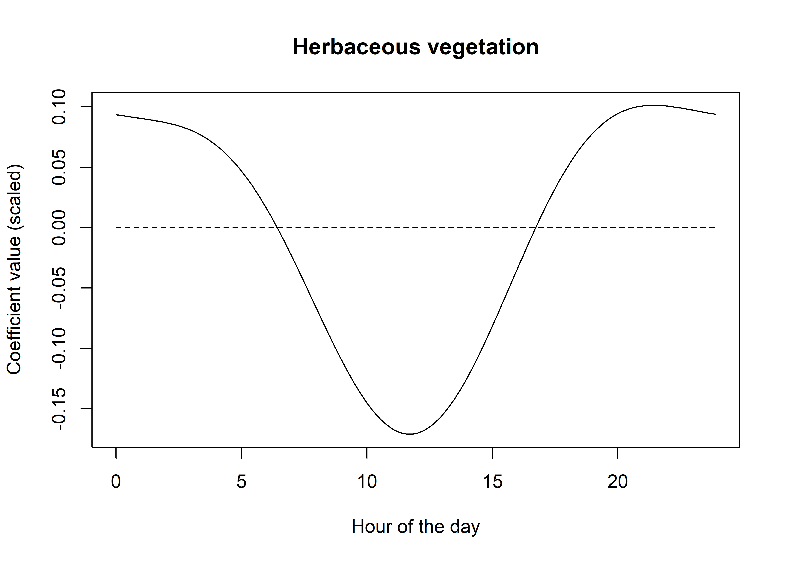{width=2100}
:::
:::


From these we can see that buffalo select for herbaceous vegetation in the early morning and late afternoon, but have a reasonably strong avoidance of it in the middle of the day (and therefore a selection for woody vegetation). This aligns with what we know about buffalo behaviour (and the climate in Northern Australia's tropical savannas), in that they are likely to be seeking shelter during this time due to high temperatures and sun.

## Reconstructing temporally dynamic coefficients using matrix multiplication

Now that we know how the coefficients of the harmonics can be combined to form a temporally dynamic function, we can use a shortcut, which is matrix multiplication. 

First we create a matrix of the harmonics, which is just the sin and cos terms for each harmonic, and then we can multiply this by the coefficients to get the function. When we use two pairs of harmonics we will have 5 coefficients for each covariate (linear + 2 sine and 2 cosine), so there will be 5 columns in the matrix.

For matrix multiplication, the number of columns in the first matrix must be equal to the number of rows in the second matrix. The result will then have the same number of rows as the first matrix and the same number of columns as the second matrix. 

Or in other words, if we have a 24 x 5 matrix of harmonics and a 5 x 1 matrix of coefficients, we will get a 24 x 1 matrix of the function, which corresponds to our 24 hours of the day.


::: {.cell}

```{.r .cell-code}
# we'll return the increments back to 1 hour for this example, 
# just so everything is a bit clearer
hour_seq <- seq(0,23,1)

hour_harmonics_matrix <- as.matrix(data.frame("linear_term" = rep(1, length(hour_seq)),
                                              "hour_s1" = sin(2*pi*hour_seq/24),
                                              "hour_s2" = sin(4*pi*hour_seq/24),
                                              "hour_c1" = cos(2*pi*hour_seq/24),
                                              "hour_c2" = cos(4*pi*hour_seq/24)))

# now have a 24 x 5 matrix
head(hour_harmonics_matrix)
```

::: {.cell-output .cell-output-stdout}

```
     linear_term   hour_s1   hour_s2   hour_c1                    hour_c2
[1,]           1 0.0000000 0.0000000 1.0000000  1.00000000000000000000000
[2,]           1 0.2588190 0.5000000 0.9659258  0.86602540378443870761060
[3,]           1 0.5000000 0.8660254 0.8660254  0.50000000000000011102230
[4,]           1 0.7071068 1.0000000 0.7071068  0.00000000000000006123032
[5,]           1 0.8660254 0.8660254 0.5000000 -0.49999999999999977795540
[6,]           1 0.9659258 0.5000000 0.2588190 -0.86602540378443870761060
```


:::
:::


We can now pull out the coefficients for each covariate and multiply by the matrix to get our temporally dynamic function. I'll do this bit by bit initially.

Starting with the scaled NDVI covariate


::: {.cell}

```{.r .cell-code}
# this subsets the coefficients for the covariate of interest 
# (grepl uses string matching, and we include ndvi but exclude the quadratic term)
ndvi_coefs <- coefs_clr %>% filter(grepl("ndvi", coefs) & !grepl("sq", coefs)) 
ndvi_coefs
```

::: {.cell-output-display}
`````{=html}
<div data-pagedtable="false">
  <script data-pagedtable-source type="application/json">
{"columns":[{"label":[""],"name":["_rn_"],"type":[""],"align":["left"]},{"label":["coefs"],"name":[1],"type":["chr"],"align":["left"]},{"label":["value"],"name":[2],"type":["dbl"],"align":["right"]},{"label":["scale_sd"],"name":[3],"type":["dbl"],"align":["right"]},{"label":["value_nat"],"name":[4],"type":["dbl"],"align":["right"]}],"data":[{"1":"ndvi","2":"1.1618933","3":"0.1433974","4":"8.1026108","_rn_":"ndvi"},{"1":"ndvi_s1","2":"0.7149228","3":"0.2379242","4":"3.0048344","_rn_":"ndvi_s1"},{"1":"ndvi_s2","2":"0.1130551","3":"0.2377890","4":"0.4754431","_rn_":"ndvi_s2"},{"1":"ndvi_c1","2":"-0.9671830","3":"0.2427744","4":"-3.9838750","_rn_":"ndvi_c1"},{"1":"ndvi_c2","2":"1.2041512","3":"0.2429118","4":"4.9571546","_rn_":"ndvi_c2"}],"options":{"columns":{"min":{},"max":[10]},"rows":{"min":[10],"max":[10]},"pages":{}}}
  </script>
</div>
`````
:::

```{.r .cell-code}
# pull out the coefficients - this comes out as a column vector, 
# which we'll convert to a matrix
ndvi_coefs_matrix <- matrix(ndvi_coefs %>% pull(value))
ndvi_coefs_matrix
```

::: {.cell-output .cell-output-stdout}

```
           [,1]
[1,]  1.1618933
[2,]  0.7149228
[3,]  0.1130551
[4,] -0.9671830
[5,]  1.2041512
```


:::

```{.r .cell-code}
# now we can multiply the matrix by the coefficients to get the function
ndvi_harmonic_function <- hour_harmonics_matrix %*% ndvi_coefs_matrix
# ndvi_harmonic_function

# plot the function
plot(hour_seq, ndvi_harmonic_function, type = "l", col = "black", 
     xlab = "Hour of the day", ylab = "Coefficient value", 
     main = "NDVI - linear term")
lines(hour_seq, rep(0,length(hour_seq)), lty = "dashed")
```

::: {.cell-output-display}
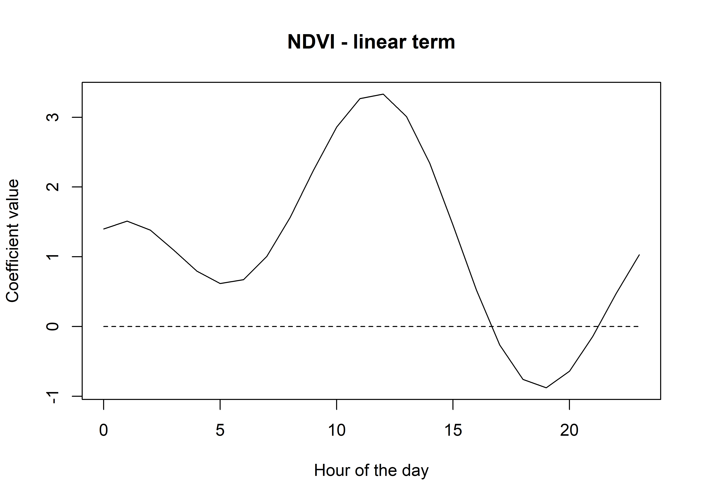{width=2100}
:::
:::


Now we can just repeat the process for all of the covariates, and put it all into a dataframe.


::: {.cell}

```{.r .cell-code}
# back to the finer resolution for smoother plotting
hour <- seq(0,23.9,0.1)

hour_harmonics_matrix <- as.matrix(data.frame("linear_term" = rep(1, length(hour)),
                                              "hour_s1" = sin(2*pi*hour/24),
                                              "hour_s2" = sin(4*pi*hour/24),
                                              "hour_c1" = cos(2*pi*hour/24),
                                              "hour_c2" = cos(4*pi*hour/24)))

harmonics_df_2p <- data.frame(
  "hour" = hour,
  "ndvi" = hour_harmonics_matrix %*% 
    matrix(coefs_clr %>% filter(grepl("ndvi", coefs) & !grepl("sq", coefs)) %>% pull(value)),
  "ndvi_2" = hour_harmonics_matrix %*% 
    matrix(coefs_clr %>% filter(grepl("ndvi_sq", coefs)) %>% pull(value)),
  "canopy" = hour_harmonics_matrix %*% 
    matrix(coefs_clr %>% filter(grepl("canopy", coefs) & !grepl("sq", coefs)) %>% pull(value)),
  "canopy_2" = hour_harmonics_matrix %*% 
    matrix(coefs_clr %>% filter(grepl("canopy_sq", coefs)) %>% pull(value)),
  "slope" = hour_harmonics_matrix %*% 
    matrix(coefs_clr %>% filter(grepl("slope", coefs)) %>% pull(value)),
  "herby" = hour_harmonics_matrix %*% 
    matrix(coefs_clr %>% filter(grepl("herby", coefs)) %>% pull(value)),
  "sl" = hour_harmonics_matrix %*% 
    matrix(coefs_clr %>% filter(grepl("step", coefs) & !grepl("log", coefs)) %>% pull(value)),
  "log_sl" = hour_harmonics_matrix %*% 
    matrix(coefs_clr %>% filter(grepl("log_step", coefs)) %>% pull(value)),
  "cos_ta" = hour_harmonics_matrix %*% 
    matrix(coefs_clr %>% filter(grepl("turn_a", coefs)) %>% pull(value))
  )

head(harmonics_df_2p)
```

::: {.cell-output-display}
`````{=html}
<div data-pagedtable="false">
  <script data-pagedtable-source type="application/json">
{"columns":[{"label":[""],"name":["_rn_"],"type":[""],"align":["left"]},{"label":["hour"],"name":[1],"type":["dbl"],"align":["right"]},{"label":["ndvi"],"name":[2],"type":["dbl"],"align":["right"]},{"label":["ndvi_2"],"name":[3],"type":["dbl"],"align":["right"]},{"label":["canopy"],"name":[4],"type":["dbl"],"align":["right"]},{"label":["canopy_2"],"name":[5],"type":["dbl"],"align":["right"]},{"label":["slope"],"name":[6],"type":["dbl"],"align":["right"]},{"label":["herby"],"name":[7],"type":["dbl"],"align":["right"]},{"label":["sl"],"name":[8],"type":["dbl"],"align":["right"]},{"label":["log_sl"],"name":[9],"type":["dbl"],"align":["right"]},{"label":["cos_ta"],"name":[10],"type":["dbl"],"align":["right"]}],"data":[{"1":"0.0","2":"1.398861","3":"-1.626129","4":"0.5243399","5":"-0.7051172","6":"-0.3126549","7":"0.09354464","8":"-0.9256585","9":"0.035925078","10":"-0.09153942","_rn_":"1"},{"1":"0.1","2":"1.422174","3":"-1.639864","4":"0.5172657","5":"-0.7004248","6":"-0.3168952","7":"0.09320481","8":"-0.9582137","9":"0.025273949","10":"-0.10220268","_rn_":"2"},{"1":"0.2","2":"1.442824","3":"-1.652477","4":"0.5094749","5":"-0.6951448","6":"-0.3209175","7":"0.09287242","8":"-0.9898296","9":"0.014740662","10":"-0.11272487","_rn_":"3"},{"1":"0.3","2":"1.460796","3":"-1.663959","4":"0.5009980","5":"-0.6892959","6":"-0.3247115","7":"0.09254716","8":"-1.0204256","9":"0.004348036","10":"-0.12307934","_rn_":"4"},{"1":"0.4","2":"1.476081","3":"-1.674300","4":"0.4918673","5":"-0.6828977","6":"-0.3282675","7":"0.09222852","8":"-1.0499241","9":"-0.005881155","10":"-0.13323979","_rn_":"5"},{"1":"0.5","2":"1.488682","3":"-1.683496","4":"0.4821169","5":"-0.6759713","6":"-0.3315766","7":"0.09191579","8":"-1.0782500","9":"-0.015924233","10":"-0.14318038","_rn_":"6"}],"options":{"columns":{"min":{},"max":[10]},"rows":{"min":[10],"max":[10]},"pages":{}}}
  </script>
</div>
`````
:::

```{.r .cell-code}
# turning into a long data frame for plotting with ggplot
harmonics_df_2p_long <- pivot_longer(harmonics_df_2p, cols = !1, names_to = "coef")
```
:::


Now we can plot all these together to see the temporal dynamics of the coefficients. Keep in mind that these are the scaled coefficients.


::: {.cell}

```{.r .cell-code}
ggplot() +
  geom_path(data = harmonics_df_2p_long,
            aes(x = hour, y = value, colour = coef)) +
  geom_hline(yintercept = 0, linetype = "dashed") +
  scale_y_continuous(expression(Time-varying~parameter~values~beta)) +
  scale_x_continuous("Hour", breaks = seq(0,24,2)) +
  scale_color_discrete("Estimate") +
  theme_classic() +
  theme(legend.position = "bottom")
```

::: {.cell-output-display}
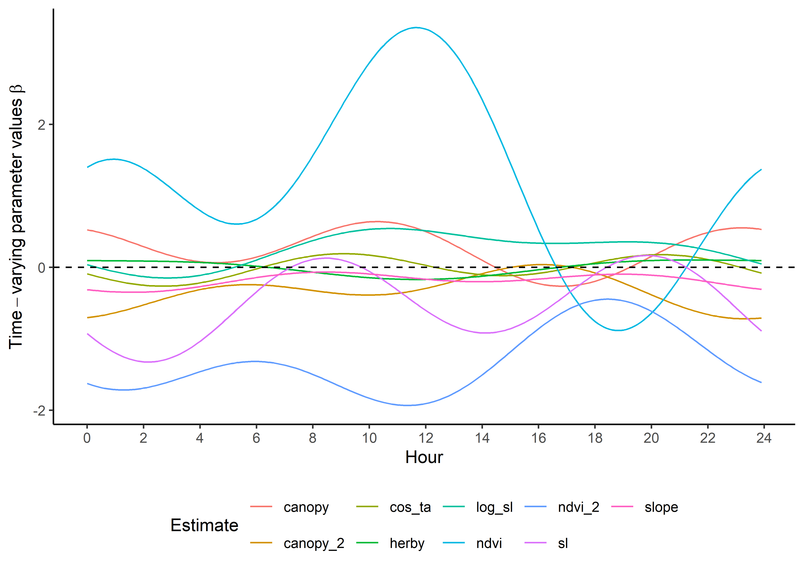{width=2100}
:::
:::


We can do the same with the natural scale coefficients.


::: {.cell}

```{.r .cell-code}
harmonics_nat_df_2p <- data.frame(
  "hour" = hour,
  "ndvi" = hour_harmonics_matrix %*% 
    matrix(coefs_clr %>% filter(grepl("ndvi", coefs) & !grepl("sq", coefs)) %>% pull(value_nat)),
  "ndvi_2" = hour_harmonics_matrix %*%
    matrix(coefs_clr %>% filter(grepl("ndvi_sq", coefs)) %>% pull(value_nat)),
  "canopy" = hour_harmonics_matrix %*% 
    matrix(coefs_clr %>% filter(grepl("canopy", coefs) & !grepl("sq", coefs)) %>% pull(value_nat)),
  "canopy_2" = hour_harmonics_matrix %*% 
    matrix(coefs_clr %>% filter(grepl("canopy_sq", coefs)) %>% pull(value_nat)),
  "slope" = hour_harmonics_matrix %*% 
    matrix(coefs_clr %>% filter(grepl("slope", coefs)) %>% pull(value_nat)),
  "herby" = hour_harmonics_matrix %*% 
    matrix(coefs_clr %>% filter(grepl("herby", coefs)) %>% pull(value_nat)),
  "sl" = hour_harmonics_matrix %*% 
    matrix(coefs_clr %>% filter(grepl("step", coefs) & !grepl("log", coefs)) %>% pull(value_nat)),
  "log_sl" = hour_harmonics_matrix %*% 
    matrix(coefs_clr %>% filter(grepl("log_step", coefs)) %>% pull(value_nat)),
  "cos_ta" = hour_harmonics_matrix %*% 
    matrix(coefs_clr %>% filter(grepl("turn_a", coefs)) %>% pull(value_nat))
  )

head(harmonics_nat_df_2p)
```

::: {.cell-output-display}
`````{=html}
<div data-pagedtable="false">
  <script data-pagedtable-source type="application/json">
{"columns":[{"label":[""],"name":["_rn_"],"type":[""],"align":["left"]},{"label":["hour"],"name":[1],"type":["dbl"],"align":["right"]},{"label":["ndvi"],"name":[2],"type":["dbl"],"align":["right"]},{"label":["ndvi_2"],"name":[3],"type":["dbl"],"align":["right"]},{"label":["canopy"],"name":[4],"type":["dbl"],"align":["right"]},{"label":["canopy_2"],"name":[5],"type":["dbl"],"align":["right"]},{"label":["slope"],"name":[6],"type":["dbl"],"align":["right"]},{"label":["herby"],"name":[7],"type":["dbl"],"align":["right"]},{"label":["sl"],"name":[8],"type":["dbl"],"align":["right"]},{"label":["log_sl"],"name":[9],"type":["dbl"],"align":["right"]},{"label":["cos_ta"],"name":[10],"type":["dbl"],"align":["right"]}],"data":[{"1":"0.0","2":"9.075890","3":"-15.67385","4":"2.148575","5":"-4.214259","6":"-0.3456849","7":"0.1663655","8":"-0.002818578","9":"0.03686862","10":"-0.1787949","_rn_":"1"},{"1":"0.1","2":"9.174002","3":"-15.80184","4":"2.125578","5":"-4.187428","6":"-0.3507639","7":"0.1657727","8":"-0.002926019","9":"0.03363340","10":"-0.2001062","_rn_":"2"},{"1":"0.2","2":"9.261153","3":"-15.91965","4":"2.100302","5":"-4.157294","6":"-0.3555871","7":"0.1651897","8":"-0.003030345","9":"0.03043430","10":"-0.2211377","_rn_":"3"},{"1":"0.3","2":"9.337273","3":"-16.02717","4":"2.072845","5":"-4.123963","6":"-0.3601421","7":"0.1646157","8":"-0.003131292","9":"0.02727827","10":"-0.2418363","_rn_":"4"},{"1":"0.4","2":"9.402330","3":"-16.12433","4":"2.043312","5":"-4.087548","6":"-0.3644176","7":"0.1640500","8":"-0.003228602","9":"0.02417223","10":"-0.2621493","_rn_":"5"},{"1":"0.5","2":"9.456325","3":"-16.21107","4":"2.011813","5":"-4.048170","6":"-0.3684024","7":"0.1634912","8":"-0.003322027","9":"0.02112309","10":"-0.2820249","_rn_":"6"}],"options":{"columns":{"min":{},"max":[10]},"rows":{"min":[10],"max":[10]},"pages":{}}}
  </script>
</div>
`````
:::

```{.r .cell-code}
# turning into a long data frame for plotting with ggplot
harmonics_nat_df_2p_long <- pivot_longer(harmonics_nat_df_2p, cols = !1, names_to = "coef")
```
:::


Plot the natural scale coefficients. These are now on quite different scales as the covariates are on different scales - particularly the previous space use density, which we'll omit from this plot.


::: {.cell}

```{.r .cell-code}
ggplot() +
  geom_path(data = harmonics_nat_df_2p_long,
            aes(x = hour, y = value, colour = coef)) +
  geom_hline(yintercept = 0, linetype = "dashed") +
  scale_y_continuous(expression(Time-varying~parameter~values~beta)) +
  scale_x_continuous("Hour", breaks = seq(0,24,2)) +
  scale_color_discrete("Estimate") +
  theme_classic() +
  theme(legend.position = "bottom")
```

::: {.cell-output-display}
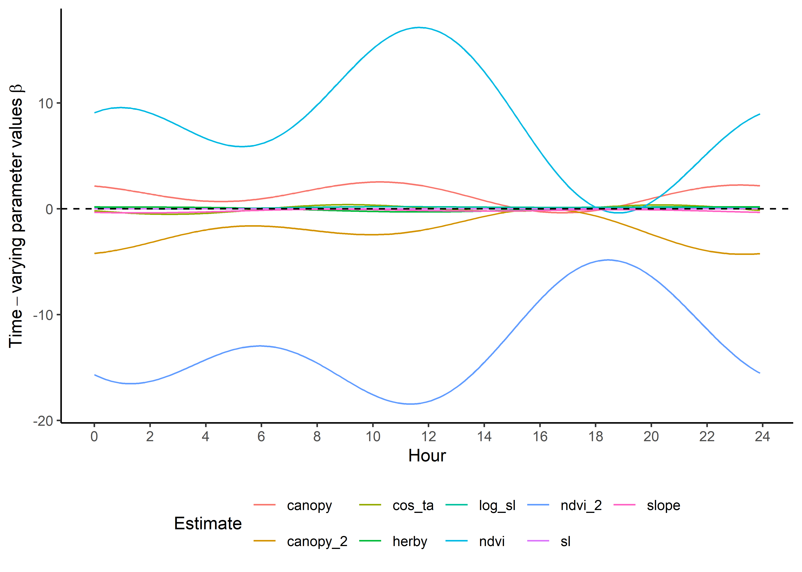{width=2100}
:::
:::


To update the Gamma and von Mises distribution from the tentative distributions from @Fieberg2021-wx, Appendix C, we just do the calculation at each time point.


::: {.cell}

```{.r .cell-code}
tentative_shape <- 0.438167
tentative_scale <- 534.3507
tentative_kappa <- 0.1848126

hour_coefs_nat_df_2p <- harmonics_nat_df_2p %>% mutate(shape = tentative_shape + log_sl,
                                                 scale = 1/((1/tentative_scale) - sl),
                                                 kappa = tentative_kappa + cos_ta)

# turning into a long data frame
hour_coefs_nat_long_2p <- pivot_longer(hour_coefs_nat_df_2p, cols = !1, names_to = "coef")
```
:::


Plot the updated movement parameters - notice that we're scaling the scale parameter by 1/1000 to make it more interpretable.


::: {.cell}

```{.r .cell-code}
ggplot() +
  geom_path(data = hour_coefs_nat_long_2p %>% 
            filter(coef %in% c("shape", "kappa")),
            aes(x = hour, y = value, colour = coef)) +
  geom_path(data = hour_coefs_nat_long_2p %>%
            filter(coef == "scale"),
            aes(x = hour, y = value/1000, colour = coef)) +
  geom_hline(yintercept = 0, linetype = "dashed") +
  scale_y_continuous("Value of parameter") +
  scale_x_continuous("Hour", breaks = seq(0,24,2)) +
  scale_color_discrete("Estimate") +
  theme_classic() +
  theme(legend.position = "right")
```

::: {.cell-output-display}
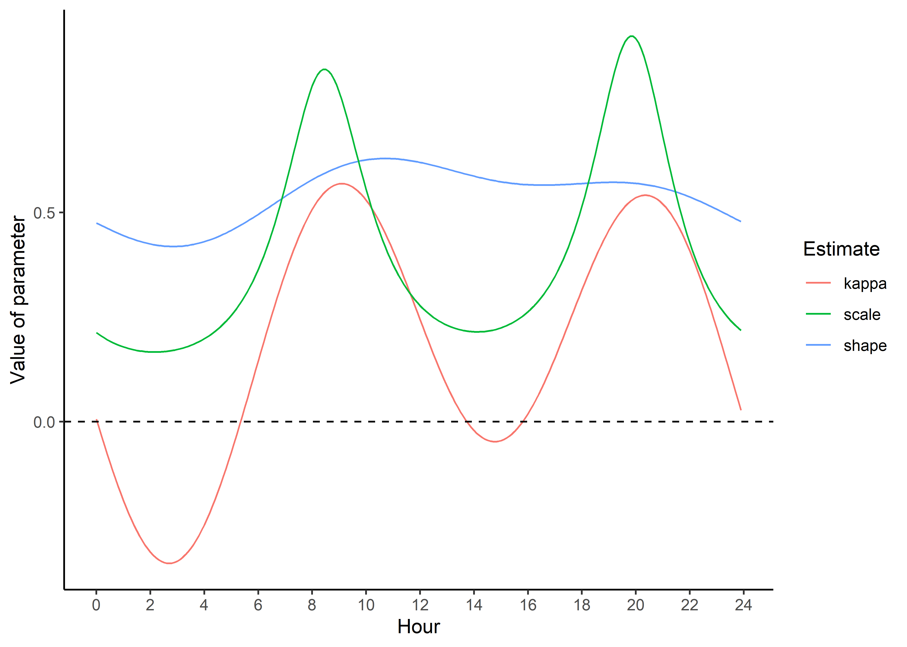{width=2100}
:::
:::


## Checking temporally dynamic movement parameters against observed data

Here we sample from the updated step length distribution (we could also follow the same process for turning angles) to generate a distribution for each hour of the day, and assess how well it matches the observed step lengths.


::: {.cell}

```{.r .cell-code}
# summarise the observed step lengths
movement_summary <- buffalo_data %>% filter(y == 1) %>%  group_by(id, hour) %>% 
  summarise(mean_sl = mean(sl), median_sl = median(sl))
```

::: {.cell-output .cell-output-stderr}

```
`summarise()` has grouped output by 'id'. You can override using the `.groups`
argument.
```


:::

```{.r .cell-code}
# number of samples from the Gamma distribution
n <- 1e5

# create some empty variables to store the results
gamma_dist_list <- vector(mode = "list", length = nrow(hour_coefs_nat_df_2p))
gamma_mean <- c()
gamma_median <- c()
gamma_ratio <- c()

for(hour_no in 1:nrow(hour_coefs_nat_df_2p)) {
  
  # sample from the Gamma distribution
  gamma_dist_list[[hour_no]] <- rgamma(n, shape = hour_coefs_nat_df_2p$shape[hour_no], 
                                       scale = hour_coefs_nat_df_2p$scale[hour_no])
  
  # summarise
  gamma_mean[hour_no] <- mean(gamma_dist_list[[hour_no]])
  gamma_median[hour_no] <- median(gamma_dist_list[[hour_no]])
  gamma_ratio[hour_no] <- gamma_mean[hour_no] / gamma_median[hour_no]

}

gamma_df_2p <- data.frame(model = "2p", 
                          hour = hour_coefs_nat_df_2p$hour, 
                          mean = gamma_mean, 
                          median = gamma_median, 
                          ratio = gamma_ratio) 

mean_sl_2p <- ggplot() +
  geom_path(data = movement_summary, 
            aes(x = hour, y = mean_sl, colour = factor(id))) +
  geom_path(data = gamma_df_2p, aes(x = hour, y = mean), 
            colour = "red", linetype = "dashed") +
  scale_x_continuous("Hour", breaks = seq(0,24,2)) +
  scale_y_continuous("Mean step length") +
  scale_colour_viridis_d("Buffalo") +
  ggtitle("Observed and modelled mean step length",
          subtitle = "Two pairs of harmonics") +
  theme_classic() +
  theme(legend.position = "none")

mean_sl_2p
```

::: {.cell-output-display}
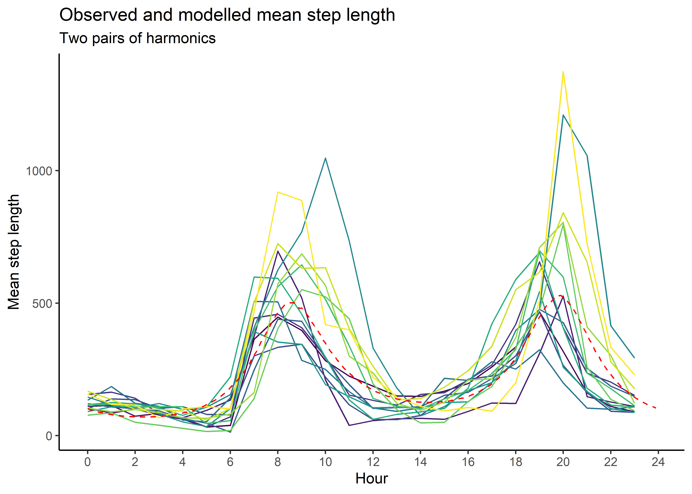{width=2100}
:::

```{.r .cell-code}
median_sl_2p <- ggplot() +
  geom_path(data = movement_summary, 
            aes(x = hour, y = median_sl, colour = factor(id))) +
  geom_path(data = gamma_df_2p, aes(x = hour, y = median), 
            colour = "red", linetype = "dashed") +
  scale_x_continuous("Hour", breaks = seq(0,24,2)) +
  scale_y_continuous("Median step length") +
  scale_colour_viridis_d("Buffalo") +
  ggtitle("Observed and modelled median step length",
          subtitle = "Two pairs of harmonics") +
  theme_classic() +
  theme(legend.position = "none")

median_sl_2p
```

::: {.cell-output-display}
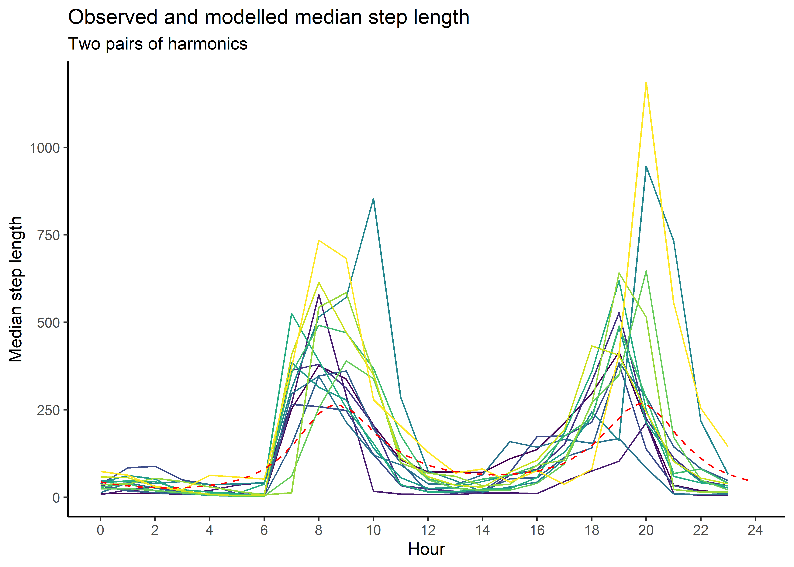{width=2100}
:::
:::


# Creating selection surfaces

As we have both quadratic and harmonic terms in the model, we can reconstruct a 'selection surface' to visualise how the coefficient changes through time.

To illustrate, we have a coefficient for the linear term and a coefficient for the quadratic term for every hour of the day (or for every time point that we used to reconstruct the temporal dynamics, which is 0.1 hour in this case). Using these coefficients, we can plot the the quadratic selection curve at the scale of the environmental variable.

Using the natural scale coefficients of NDVI from the model, let's take the coefficient from **Hour 3** and plot the quadratic curve


::: {.cell}

```{.r .cell-code}
# first get a sequence of NDVI values, starting from the minimum observed in the data to the maximum
ndvi_min <- min(buffalo_data$ndvi_temporal, na.rm = TRUE)
ndvi_max <- max(buffalo_data$ndvi_temporal, na.rm = TRUE)
ndvi_seq <- seq(ndvi_min, ndvi_max, by = 0.01)
# ndvi_seq
```
:::


Similar to the harmonics, we add the linear and quadratic terms to get the quadratic curve


::: {.cell}

```{.r .cell-code}
coef_hour <- 3

# we can separate to the linear term
ndvi_linear_coef <- hour_coefs_nat_df_2p$ndvi[which(hour_coefs_nat_df_2p$hour == coef_hour)]
ndvi_linear_coef
```

::: {.cell-output .cell-output-stdout}

```
[1] 7.885768
```


:::

```{.r .cell-code}
# multiply the coefficient by the values of NDVI 
# the coefficient is positive so this will be a positive relationship
ndvi_linear_selection <- ndvi_linear_coef * ndvi_seq 
plot(x = ndvi_seq, y = ndvi_linear_selection,
     main = "Selection for NDVI - linear term at hour 3",
     xlab = "NDVI", ylab = "Estimated selection")
lines(ndvi_seq, rep(0,length(ndvi_seq)), lty = "dashed")
```

::: {.cell-output-display}
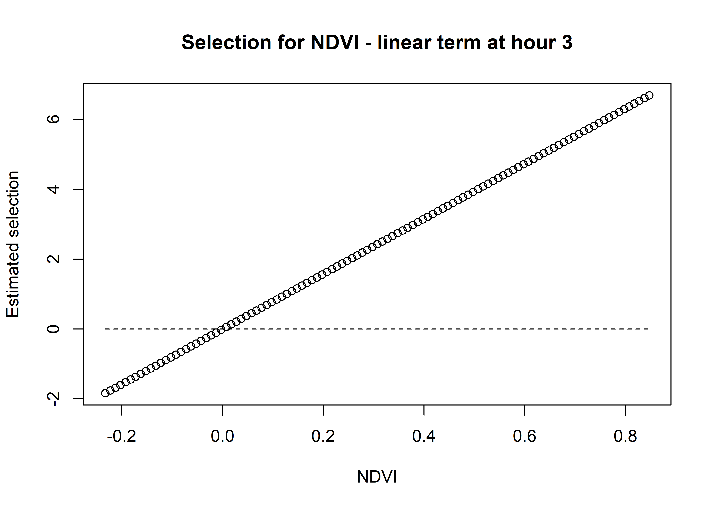{width=2100}
:::

```{.r .cell-code}
# and the quadratic term - this term is negative so it will create a 'hat' rather 
# than a 'bowl', with decreasing selection at the extremes
ndvi_quadratic_coef <- hour_coefs_nat_df_2p$ndvi_2[which(hour_coefs_nat_df_2p$hour == coef_hour)]
ndvi_quadratic_coef
```

::: {.cell-output .cell-output-stdout}

```
[1] -15.4302
```


:::

```{.r .cell-code}
# multiply the quadratic coefficient by the values of NDVI^2
ndvi_quadratic_selection <- ndvi_quadratic_coef * (ndvi_seq ^ 2)
plot(x = ndvi_seq, y = ndvi_quadratic_selection,
     main = "Selection for NDVI - quadratic term at hour 3",
     xlab = "NDVI", ylab = "Estimated selection")
lines(ndvi_seq, rep(0,length(ndvi_seq)), lty = "dashed")
```

::: {.cell-output-display}
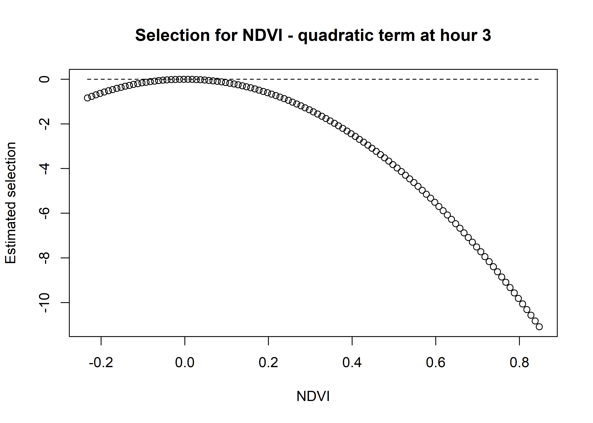{width=2100}
:::

```{.r .cell-code}
# and sum them both together
ndvi_sum_selection <- ndvi_linear_selection + ndvi_quadratic_selection
plot(x = ndvi_seq, y = ndvi_sum_selection,
     main = "Selection for NDVI - linear and quadratic terms at hour 3",
     xlab = "NDVI", ylab = "Estimated selection")
lines(ndvi_seq, rep(0,length(ndvi_seq)), lty = "dashed")
```

::: {.cell-output-display}
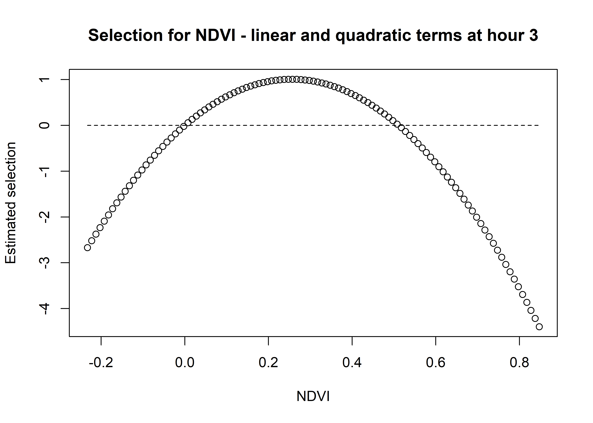{width=2100}
:::
:::


We can see that the quadratic curve at **Hour 3** shows highest selection for NDVI values slightly above 0.2, and the coefficient is greater than 0 for NDVI values from around 0 to 0.45.

For brevity we won't plot the linear and quadratic terms separetely, but we can do so if needed.

Now for **Hour 12**


::: {.cell}

```{.r .cell-code}
hour_no <- 12

# we can separate to the linear term
ndvi_linear_selection <- hour_coefs_nat_df_2p$ndvi[which(hour_coefs_nat_df_2p$hour 
                                                         == hour_no)] * ndvi_seq
# plot(x = ndvi_seq, y = ndvi_linear_selection,
#      main = "Selection for NDVI - linear term",
#      xlab = "NDVI", ylab = "Estimated selection")

# and the quadratic term
ndvi_quadratic_selection <- (hour_coefs_nat_df_2p$ndvi_2[which(hour_coefs_nat_df_2p$hour 
                                                               == hour_no)] * (ndvi_seq ^ 2))
# plot(x = ndvi_seq, y = ndvi_quadratic_selection,
#      main = "Selection for NDVI - quadratic term",
#      xlab = "NDVI", ylab = "Estimated selection")

# and the sum of both
ndvi_sum_selection <- ndvi_linear_selection + ndvi_quadratic_selection
plot(x = ndvi_seq, y = ndvi_sum_selection,
     main = "Selection for NDVI - linear and quadratic terms at hour 12",
     xlab = "NDVI", ylab = "Estimated selection")
lines(ndvi_seq, rep(0,length(ndvi_seq)), lty = "dashed")
```

::: {.cell-output-display}
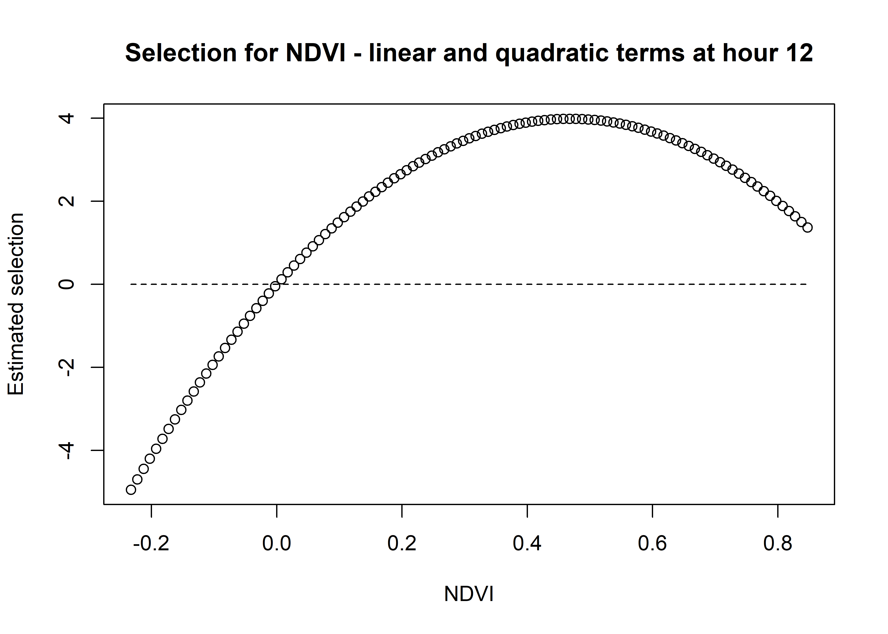{width=2100}
:::
:::


Whereas for **Hour 12**, the coefficient shows highest selection for NDVI values around 0.5, and the coefficient is positive for all NDVI values above 0. The magnitude of selection is also greater than for **Hour 3**.

We can imagine viewing these plots for every hour of the day, where each hour has a different quadratic curve, but this would be a lot of plots. Another way to look at it is as a 3D surface, where the x-axis is the hour of the day, the y-axis is the NDVI value, and the z-axis (colour) is the coefficient value.

All we have to do is index over every time point and use the linear and quadratic coefficient values to reconstruct the quadratic curves, and then combine those curves into a 3D surface.

We use the same process as above, but now we index across every time point. 

In the plotting we'll add some contours for the 0 line, to show where the coefficient is positive and negative (conditional on all other covariates).

## Selection surface for NDVI


::: {.cell}

```{.r .cell-code}
ndvi_min <- min(buffalo_data$ndvi_temporal, na.rm = TRUE)
ndvi_max <- max(buffalo_data$ndvi_temporal, na.rm = TRUE)
ndvi_seq <- seq(ndvi_min, ndvi_max, length.out = 75)

# Create empty data frame
ndvi_fresponse_df <- data.frame(matrix(ncol = nrow(hour_coefs_nat_df_2p), 
                                       nrow = length(ndvi_seq)))
# index across all time points
for(i in 1:nrow(hour_coefs_nat_df_2p)) {
  # Extract the coefficient values for the linear and quadratic terms and 
  # multiply by the NDVI values
  # Assign the vector as a column to the dataframe
  ndvi_fresponse_df[,i] <- (hour_coefs_nat_df_2p$ndvi[i] * ndvi_seq) + 
    (hour_coefs_nat_df_2p$ndvi_2[i] * (ndvi_seq ^ 2))
}

ndvi_fresponse_df <- data.frame(ndvi_seq, ndvi_fresponse_df)
colnames(ndvi_fresponse_df) <- c("ndvi", hour)
ndvi_fresponse_long <- pivot_longer(ndvi_fresponse_df, cols = !1, names_to = "hour")

ndvi_contour_max <- max(ndvi_fresponse_long$value) # 0.7890195
ndvi_contour_min <- min(ndvi_fresponse_long$value) # -0.7945691
ndvi_contour_increment <- (ndvi_contour_max-ndvi_contour_min)/10

ndvi_quad_2p <- ggplot(data = ndvi_fresponse_long, aes(x = as.numeric(hour), y = ndvi)) +
  geom_point(aes(colour = value)) + # colour = "white"
  geom_contour(aes(z = value), 
               breaks = seq(ndvi_contour_increment, ndvi_contour_max, ndvi_contour_increment), 
               colour = "black", linewidth = 0.25, linetype = "dashed") +
  geom_contour(aes(z = value), 
               breaks = seq(-ndvi_contour_increment, ndvi_contour_min, -ndvi_contour_increment), 
               colour = "red", linewidth = 0.25, linetype = "dashed") +
  geom_contour(aes(z = value), breaks = 0, colour = "black", linewidth = 0.5) +
  scale_x_continuous("Hour", breaks = seq(0,24,6)) +
  scale_y_continuous("NDVI value", breaks = seq(-1, 1, 0.25)) +
  scale_colour_viridis_c("Selection") +
  # ggtitle("Normalised Difference Vegetation Index (NDVI)") +
  theme_classic() +
  theme(legend.position = "right")

ndvi_quad_2p
```

::: {.cell-output-display}
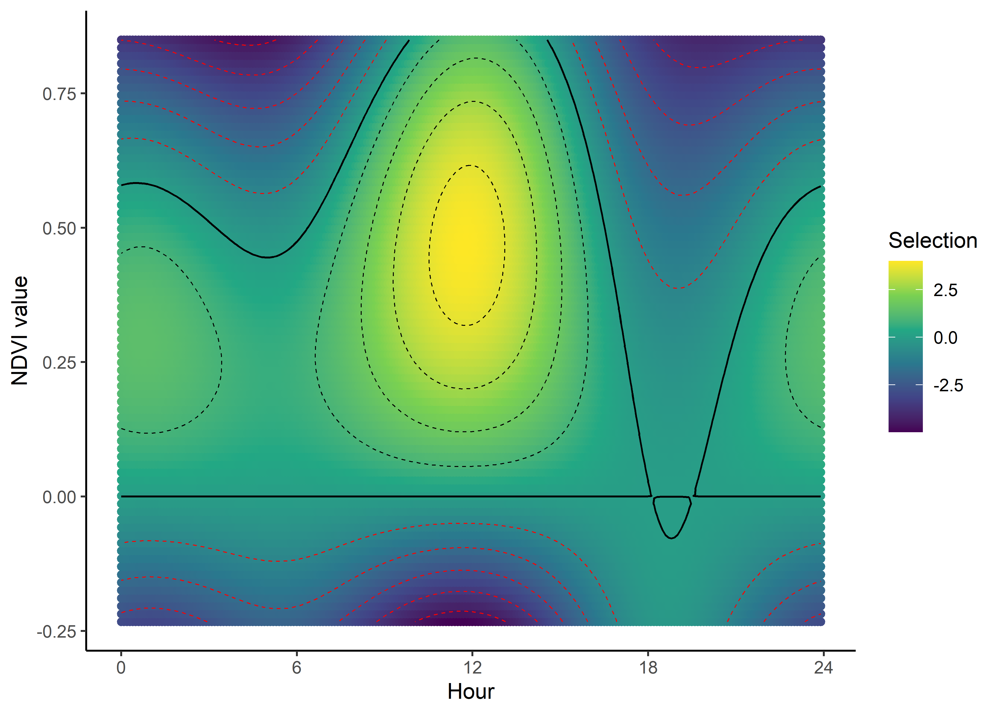{width=2100}
:::
:::


We can now see how the selection for NDVI changes throughout the day. We can clearly see the diurnal pattern of selection for NDVI, where the buffalo are seeking higher values of NDVI (centred on around 0.5) during the middle of the day, indicated by the positive coefficients, and relatively low selection for lower values of NDVI (centred on around 0.2) during the early morning and late afternoon, and negative coefficients for NDVI values above around 0.4, and strong selection against high values of NDVI. The selection against high NDVI values correlates with the movement dynamics, as they are likely moving through more open areas.

## Canopy cover


::: {.cell}

```{.r .cell-code}
canopy_min <- min(buffalo_data$canopy_01, na.rm = TRUE)
canopy_max <- max(buffalo_data$canopy_01, na.rm = TRUE)
canopy_seq <- seq(canopy_min, canopy_max, length.out = 75)

# Create empty data frame
canopy_fresponse_df <- data.frame(matrix(ncol = nrow(hour_coefs_nat_df_2p), 
                                         nrow = length(canopy_seq)))
for(i in 1:nrow(hour_coefs_nat_df_2p)) {
  # Assign the vector as a column to the dataframe
  canopy_fresponse_df[,i] <- (hour_coefs_nat_df_2p$canopy[i] * canopy_seq) + 
    (hour_coefs_nat_df_2p$canopy_2[i] * (canopy_seq ^ 2))
}

canopy_fresponse_df <- data.frame(canopy_seq, canopy_fresponse_df)
colnames(canopy_fresponse_df) <- c("canopy", hour)
canopy_fresponse_long <- pivot_longer(canopy_fresponse_df, cols = !1, names_to = "hour")

canopy_contour_min <- min(canopy_fresponse_long$value) # 0
canopy_contour_max <- max(canopy_fresponse_long$value) # 2.181749
canopy_contour_increment <- (canopy_contour_max-canopy_contour_min)/10

canopy_quad_2p <- ggplot(data = canopy_fresponse_long, aes(x = as.numeric(hour), y = canopy)) +
  geom_point(aes(colour = value)) +
  geom_contour(aes(z = value), 
               breaks = seq(canopy_contour_increment, canopy_contour_max, canopy_contour_increment), 
               colour = "black", linewidth = 0.25, linetype = "dashed") +
  geom_contour(aes(z = value),
               breaks = seq(-canopy_contour_increment, canopy_contour_min, -canopy_contour_increment),
               colour = "red", linewidth = 0.25, linetype = "dashed") +
  geom_contour(aes(z = value), breaks = 0, colour = "black", linewidth = 0.5) +
  scale_x_continuous("Hour", breaks = seq(0,24,6)) +
  scale_y_continuous("Canopy cover", breaks = seq(0, 1, 0.25)) +
  scale_colour_viridis_c("Selection") +
  # ggtitle("Canopy Cover") +
  theme_classic() +
  theme(legend.position = "right")

canopy_quad_2p
```

::: {.cell-output-display}
{width=2100}
:::
:::


The selection surface for **Canopy cover** tells a similar story to NDVI, with the buffalo selecting for higher values of canopy cover during the middle of the day, and lower values during the early morning and late afternoon, suggesting that they are seeking more cover during the hotter parts of the day. Overall the values of the coefficient are not as high as for NDVI, and only range between around -1 and +0.5, whereas for NDVI the coefficient ranges from -4 to +4, suggesting that NDVI is more influential.

## References

<div id="refs"></div> 

## Session info


::: {.cell}

```{.r .cell-code}
sessionInfo()
```

::: {.cell-output .cell-output-stdout}

```
R version 4.4.1 (2024-06-14 ucrt)
Platform: x86_64-w64-mingw32/x64
Running under: Windows 10 x64 (build 19045)

Matrix products: default


locale:
[1] LC_COLLATE=English_Australia.utf8  LC_CTYPE=English_Australia.utf8   
[3] LC_MONETARY=English_Australia.utf8 LC_NUMERIC=C                      
[5] LC_TIME=English_Australia.utf8    

time zone: Australia/Brisbane
tzcode source: internal

attached base packages:
[1] stats     graphics  grDevices utils     datasets  methods   base     

other attached packages:
 [1] scales_1.3.0        beepr_2.0           TwoStepCLogit_1.2.5
 [4] tictoc_1.2.1        lubridate_1.9.3     forcats_1.0.0      
 [7] stringr_1.5.1       dplyr_1.1.4         purrr_1.0.2        
[10] readr_2.1.5         tidyr_1.3.1         tibble_3.2.1       
[13] ggplot2_3.5.1       tidyverse_2.0.0    

loaded via a namespace (and not attached):
 [1] utf8_1.2.4        generics_0.1.3    stringi_1.8.4     lattice_0.22-6   
 [5] hms_1.1.3         digest_0.6.37     magrittr_2.0.3    evaluate_1.0.0   
 [9] grid_4.4.1        timechange_0.3.0  fastmap_1.2.0     jsonlite_1.8.8   
[13] Matrix_1.7-0      survival_3.6-4    audio_0.1-11      fansi_1.0.6      
[17] viridisLite_0.4.2 isoband_0.2.7     cli_3.6.3         crayon_1.5.3     
[21] rlang_1.1.4       bit64_4.0.5       munsell_0.5.1     splines_4.4.1    
[25] withr_3.0.1       yaml_2.3.10       parallel_4.4.1    tools_4.4.1      
[29] tzdb_0.4.0        colorspace_2.1-1  vctrs_0.6.5       R6_2.5.1         
[33] lifecycle_1.0.4   htmlwidgets_1.6.4 bit_4.0.5         vroom_1.6.5      
[37] pkgconfig_2.0.3   pillar_1.9.0      gtable_0.3.5      glue_1.7.0       
[41] xfun_0.47         tidyselect_1.2.1  knitr_1.48        farver_2.1.2     
[45] htmltools_0.5.8.1 labeling_0.4.3    rmarkdown_2.28    compiler_4.4.1   
```


:::
:::

